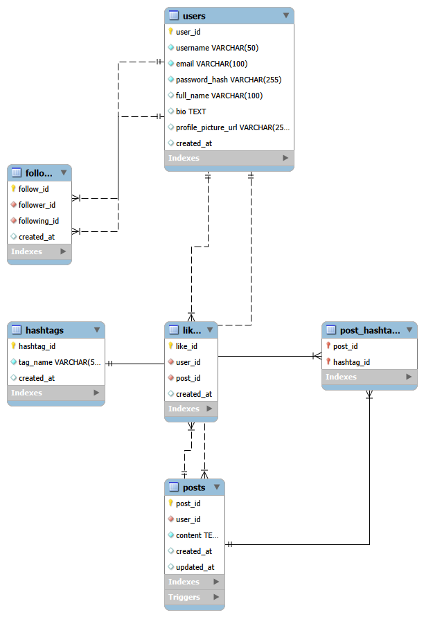

# Veritabanı Tasarımı

## Tablolar
- **Users**: Kullanıcı bilgileri
- **Posts**: Paylaşımlar  
- **Likes**: Beğeniler
- **Hashtags**: Etiketler
- **Post_Hashtags**: Post-hashtag ilişkisi (M:N)
- **Follows**: Takip ilişkileri

## Kurulum
MySQL Workbench'te çalıştır:
```sql
source schema.sql;
source sample-data.sql;
```

## Normalizasyon
- **1NF**: Tüm alanlar atomik
- **2NF**: Partial dependency yok
- **3NF**: Transitive dependency yok (örn: Hashtags ayrı tablo)

## ER Diagram


## İlişkiler
- Users 1:N Posts
- Users 1:N Likes  
- Posts 1:N Likes
- Users M:N Users (Follows)
- Posts M:N Hashtags
```